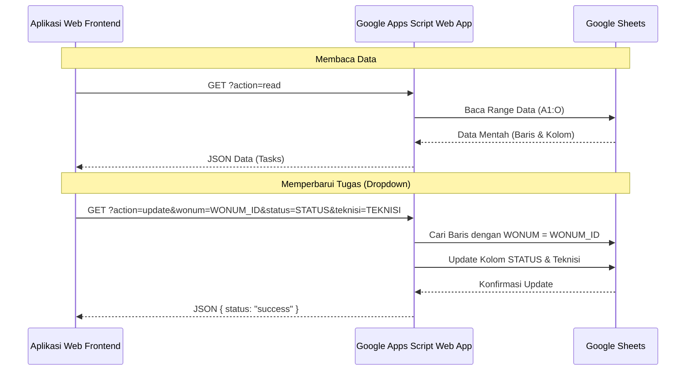

# Rencana Implementasi: Aplikasi Manajemen Tugas dengan Google Sheets & Dashboard Pivot

Aplikasi ini dirancang untuk memanajemen tugas teknisi menggunakan data dari Google Sheets. Aplikasi akan menampilkan dashboard pivot table interaktif (Baris: Teknisi, Kolom: Status). Setiap angka pada sel pivot dapat diklik/di-hover untuk menampilkan pop-up Kanban Board berisi detail tugas. Perubahan status/teknisi pada menu dropdown di Kanban Board akan langsung mengupdate Google Sheets (atau LocalStorage jika menggunakan Demo Mode).

---

## Kemudahan untuk Pemula (Ramah HTML & Python)
Karena Anda memahami HTML dan sedikit Python, kode akan dirancang dengan prinsip berikut agar **sangat mudah dipahami dan diedit**:
1. **Konfigurasi Terpusat**: Semua variabel penting (seperti daftar nama teknisi default, daftar status default, dan URL Google Sheets) akan dikelompokkan di bagian paling atas berkas `app.js` dengan petunjuk bahasa Indonesia yang jelas. Anda tidak perlu mencari ke dalam logika program yang rumit.
2. **Komentar Kode Lengkap**: Setiap fungsi JavaScript dan elemen HTML akan diberi penjelasan berbahasa Indonesia (seperti cara kerja *state*, cara memodifikasi tabel, dan bagaimana data disimpan).
3. **Tanpa Setup Server Ramping (Serverless)**: Tidak ada instalasi NodeJS, Python backend, database, atau terminal command yang rumit untuk menjalankan aplikasi ini di awal. Anda cukup klik ganda berkas `index.html` untuk menjalankannya langsung di browser!
4. **Google Apps Script Instan**: Kode Apps Script untuk Google Sheets sudah siap pakai. Anda cukup *copy-paste* (salin-tempel) tanpa perlu menulis kode pemrograman baru di Google Sheets.

---

## Fitur Utama

1. **Dashboard Pivot Table**:
   - Baris: Nama Teknisi.
   - Kolom: Status Tugas (contoh: *Todo*, *In Progress*, *Pending*, *Completed*).
   - Sel: Jumlah tugas (menunjukkan angka). Terdapat hover effect yang menarik dan click handler.
   - Ringkasan total tugas per baris dan per kolom.

2. **Kanban Pop-up Board**:
   - Muncul saat sel pivot diklik atau di-hover (dengan opsi klik untuk mengunci pop-up agar tidak hilang).
   - Menampilkan detail data tugas dalam bentuk kartu Kanban.
   - Setiap kartu memiliki dropdown **Status** dan **Teknisi**.

3. **Sinkronisasi Google Sheets (Real-time)**:
   - Terintegrasi menggunakan **Google Apps Script Web App** (cepat, tanpa server backend, aman, dan tanpa biaya).
   - Perubahan dropdown langsung mengirim request ke Web App URL dan mengupdate baris yang sesuai di spreadsheet.

4. **Demo Mode (Out-of-the-box)**:
   - Jika belum menghubungkan Google Sheets, aplikasi berjalan dalam "Demo Mode" menggunakan `localStorage`.
   - Pengguna dapat mencoba seluruh fitur (tambah tugas, ubah status, ubah teknisi) secara langsung saat membuka aplikasi pertama kali.

5. **Desain Premium & Modern**:
   - Dark/Light mode toggle.
   - Menggunakan CSS Modern (Flexbox, Grid, CSS Variables, Glassmorphism).
   - Transisi halus (animations) pada hover dan pemindahan kartu.
   - Responsif di perangkat desktop maupun mobile.

---

## Struktur Proyek

Aplikasi akan dibuat dalam struktur yang bersih dan modular agar mudah dimodifikasi di kemudian hari:

```text
Dashboar_WO/
├── index.html                   # Halaman utama aplikasi (UI & Layout)
├── style.css                    # Desain sistem, variabel warna, tema, dan animasi
├── app.js                       # Logika aplikasi (State, Render, Event Handlers, API)
└── google-apps-script.js        # Script untuk disalin ke Google Sheets Apps Script
```

---

## Detail Rencana Komponen

### 1. `index.html`
- Menyediakan layout modern dengan sidebar navigasi/pengaturan dan main content area.
- Form/Panel untuk konfigurasi API Google Sheets (Web App URL) beserta switch "Demo Mode / Google Sheets Mode".
- Tempat penampung Pivot Table dan Kanban Pop-up Modal.
- Form untuk mencari WO (Work Order) dan menambah tugas baru langsung dari dashboard.

### 2. `style.css`
- Mendefinisikan tema modern (warna slate-dark premium, neon accent, status badges berwarna harmonis).
- Glassmorphism effects untuk modal popup.
- Responsivitas penuh untuk berbagai resolusi layar.

### 3. `app.js`
- **State Management**: Menyimpan data tugas (WO), daftar teknisi, daftar status, dan konfigurasi API.
- **Pemetaan Kolom Spreadsheet**:
  - Kolom ID unik: `WONUM`
  - Kolom Status: `STATUS`
  - Kolom Teknisi: `Teknisi`
  - Kolom Detail: `CUST NAME` (Nama Pelanggan), `INET NUMBER` (No Internet), `PAKET` (Paket Layanan), `ALPRO` (Alat Produksi/ODP), `ALAMAT` (Alamat Lengkap), `KONTAK` (No HP), `KETERANGAN`, dan `STO`.
- **Pivot Processor**: Fungsi untuk menghitung frekuensi status per teknisi berdasarkan data di atas.
- **Kanban Modal Manager**: Mengelola logika membuka pop-up kartu detail saat sel diklik, memfilter tugas berdasarkan nama teknisi & status dari sel tersebut.
- **Data Sync**:
  - `fetchData()`: Mengambil data dari API Google Sheets (format JSON) atau `localStorage`.
  - `updateTask(wonum, newStatus, newTechnician)`: Mengirim update ke API Google Sheets atau memperbarui `localStorage`.

### 4. `google-apps-script.js`
- Script Apps Script Google Sheets yang akan dideploy sebagai Web App.
- Menangani parameter request:
  - `action=read`: Membaca seluruh data dari sheet dan mengirimkannya sebagai format JSON terstruktur.
  - `action=update`: Mencari baris berdasarkan `WONUM` tugas dan mengupdate kolom `STATUS` dan `Teknisi`.

---

## Alur Integrasi Google Sheets



---

## Rencana Verifikasi

### Manual Verification
1. **Fungsi Demo Mode**:
   - Buka `index.html` langsung di browser.
   - Pastikan pivot table menampilkan data simulasi teknisi dan status sesuai data contoh Anda (seperti `ABIL - HAFIZ` dan status `ANTRIAN PROGRES`).
   - Hover dan klik sel pivot: verifikasi pop-up Kanban muncul dan menampilkan detail tugas (Nama Pelanggan, Alamat, No Internet, dll).
   - Ubah status atau teknisi lewat dropdown di dalam pop-up, lalu pastikan sel pivot terupdate secara real-time.

2. **Fungsi Google Sheets (Uji Coba Hubungan)**:
   - Buat Google Sheets baru dan salin contoh data Anda di dalamnya.
   - Pasang script dari `google-apps-script.js` melalui menu Ekstensi > Apps Script.
   - Deploy script sebagai Web App dengan akses "Anyone" (Siapa saja).
   - Salin URL Web App dan masukkan ke menu pengaturan aplikasi web frontend.
   - Nonaktifkan "Demo Mode" dan pastikan data tersinkronisasi langsung dari Google Sheets Anda.
   - Lakukan perubahan dropdown di pop-up aplikasi, lalu verifikasi data di Google Sheets berubah dalam beberapa detik.
